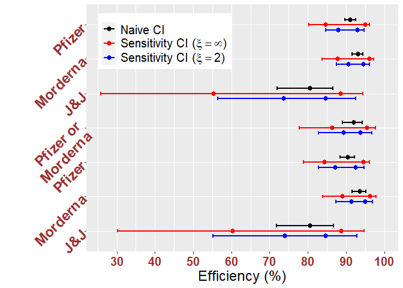
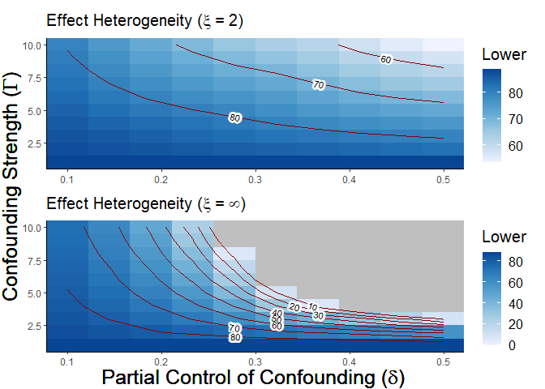
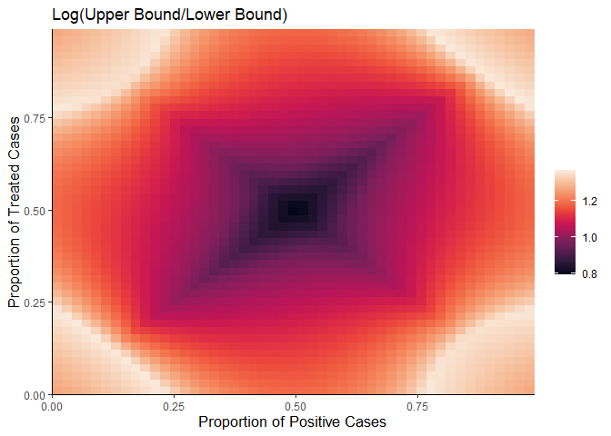
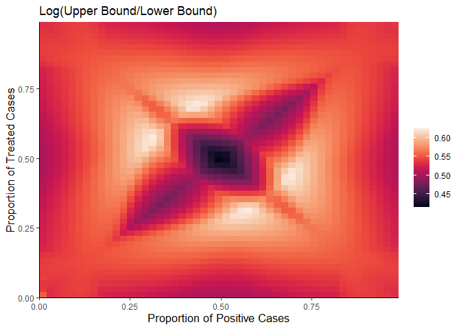

Plots
================

# Real Data Plots

## Vaccine Comparison

``` r
# Figure 2(a)
source('./scripts/real_data_plots.R')
real_data_graphs(data, 
                 delta = 0.1, gamma = 5, xi = c(2, Inf), alpha = 0.95, conf.type = 'normal',
                 title = "Vaccine Efficiency for Different Vaccines", 
                 labs = c("Pfizer", "Morderna", "J&J", "Pfizer or\nMorderna", 
                          "Pfizer", "Morderna", "J&J"))
```

<!-- -->

## Contour Plot for Pfizer

``` r
# Figure 2(b)
source('./scripts/heatmap.R')
causal_bounds_heatmap(c(as.numeric(data[1,])), 
                      delta.range = c(0.1, 0.5), gamma.range = c(1,10), xi = c(2,Inf), 
                      alpha = 0.95, conf.type = "normal",  ,
                      OR = seq(0.1,0.9,0.1), bound.type = 'upper', n.contours = 5, grid = 10)
```

<!-- -->

# Numerical Simulations

## Compare Confidence Interval

``` r
# Figure A1
source('./scripts/CI_compare.R')
set.seed(123)
o = c(0.1, 0.2, 0.3, 0.4)
CI_comparison(o, delta=0.1, gamma=5, xi=2, alpha=0.95, n.population=1000, n.sim=20)
```

<!-- -->

## Heatmap for same Odds Ratio

``` r
# Figure A2(a)
source('./scripts/heatmap_same_odds_ratio.R')
heatmap_same_odds_ratio(0.5, 0.1, 5, xi = Inf, choice = 1, grid = 50, log.transform = TRUE)
```

<!-- -->

``` r
# Figure A2(b)
source('./scripts/heatmap_same_odds_ratio.R')
heatmap_same_odds_ratio(0.5, 0.1, 5, xi = 2,   choice = 1, grid = 50, log.transform = TRUE)
```

<!-- -->
