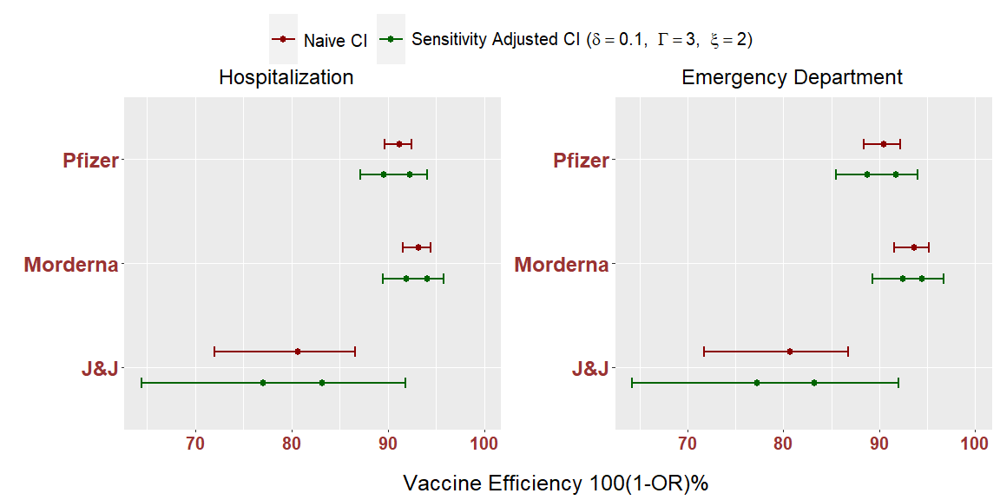
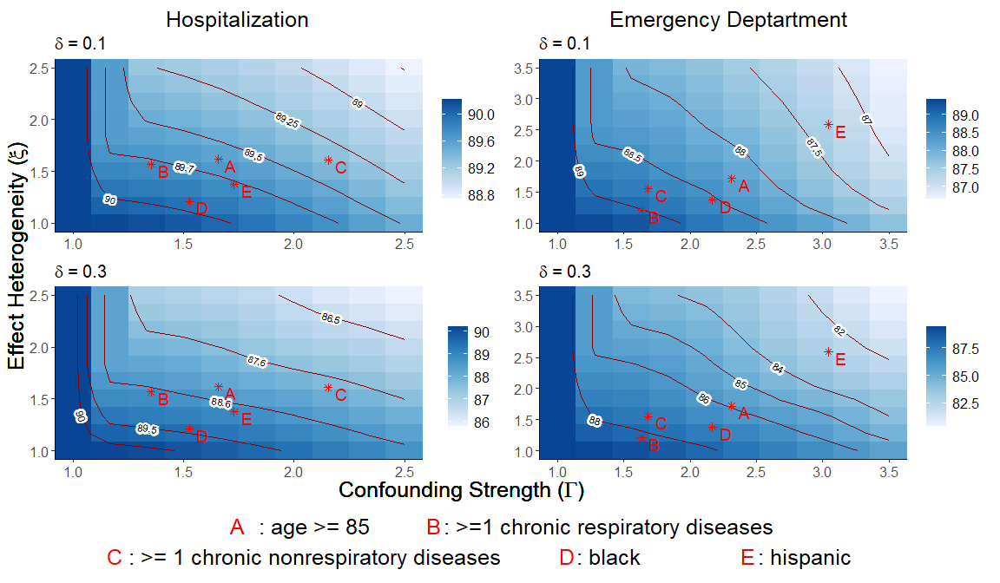
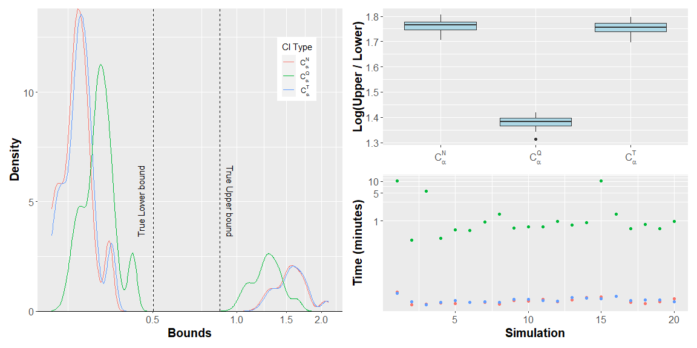
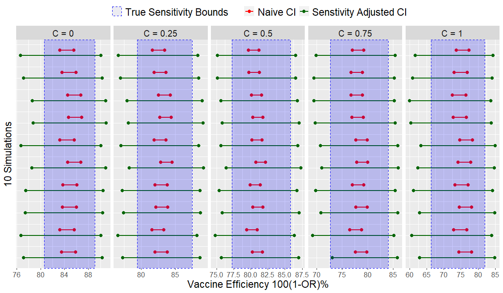

# Real Data Plots

## Vaccine Comparison

``` r
# Figure 2
source('scripts/bounds_compare.R')

load('data.rda')
vacccine_efficiency_comparison(data_vaccine, delta = 0.1, gamma = 3, xi = 2, alpha = 0.95, conf.type = 'quadratic')
```


## Heatmap and Contour plot

``` r
# Figure 3
source('scripts/heatmap.R')
source('scripts/real_data_plots.R')

load('data.rda')
heatmap_confounders(data_confounders, grid = 10, alpha = 0.95, conf.type = 'normal')
```


# Numerical Simulations

## Confidence Interval Comparison

``` r
# Figure A1
source('scripts/CI_compare.R')

set.seed(123)
o = c(0.1, 0.2, 0.3, 0.4)
CI_comparison(o, delta=0.1, gamma=5, xi=2, alpha=0.95, n.population=1000, n.sim=20)
```



## Heatmap for same Odds Ratio
``` r
# Figure A2(a)
source('scripts/heatmap_same_odds_ratio.R')
heatmap_same_odds_ratio(0.5, delta = 0.1, gamma = 5, xi=Inf, grid=50, log.transform=TRUE)
```

.png)
``` r
# Figure A2(b)
source('./scripts/heatmap_same_odds_ratio.R')
heatmap_same_odds_ratio(0.5, delta = 0.1, gamma = 5, xi=2, grid=50, log.transform=TRUE)
```
.png)

## Continuous Confounder Simulation
``` r
# Figure A3
source('scripts/continuous.R')
set.seed(123456)
plot_continuous_confounder_simultaion(delta = 0.1, gamma = 5, xi = 2, n.test = 5, n.population = 50000, n.sim = 10, alpha = 0.95, conf.type = 'quadratic')
```
    ##      intercept slope
    ## B_00       0.0   0.0
    ## B_10       0.5   0.5
    ## B_01       1.3  -1.3
    ## B_11      -0.1  -0.3

